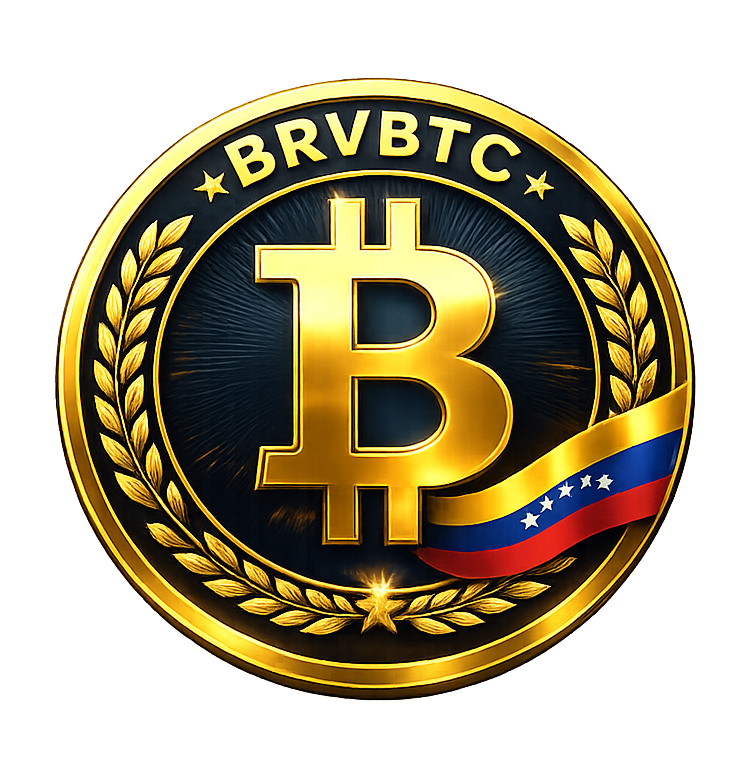

# BRVBTC
<p align="center">
  
</p>
A revolutionary stable token pegged to BTC with 50% on-chain reserve. Native on Ethereum & Polygon.

# 🇻🇪 Bolivar Republica Venezuela BTC (BRVBTC)

**A Revolutionary Stable Token Pegged to BTC with 50% On-Chain Reserve**

BRVBTC is not just another stablecoin. It's a hybrid between a stable asset and a Bitcoin-backed reserve token, designed to offer stability, transparency, and decentralization — all powered by real WBTC and immutable smart contracts.

---
[](https://opensource.org/licenses/MIT)
[](https://soliditylang.org/)
[](https://book.getfoundry.sh/)
[](https://github.com/josat123/BRVBTC/security)
[](https://polygonscan.com/address/0xa5c96d77C280B9F4bA13cd4064C4864Cf69a3BCB#code)
[](https://opensource.org/licenses/MIT)
[](https://ethereum.org)
[](https://polygon.technology)
[](https://etherscan.io/address/0x9bc0F4d4B31AdEa0c7Fde6f40a778E4Ce7Bc652d)
[](https://polygonscan.com/address/0xa5c96d77C280B9F4bA13cd4064C4864Cf69a3BCB)
[](https://etherscan.io/address/0xe8681d55585FcDA6a4a39c9a59f39b63fbBa88e8)
[](https://polygonscan.com/address/0x0Ef6a63a16fB21dD8398183a154596953Ce4E835)
[](https://polygonscan.com/address/0x67366782805870060151383f4bbff9dab53e5cd6)

## 📌 Overview

| Feature | Value |
|--------|-------|
| **Token Name** | Bolivar Republica Venezuela BTC |
| **Symbol** | BRVBTC |
| **Blockchain** | Ethereum (L1) & Polygon (L2) |
| **Standard** | ERC20, ERC20Permit, ERC20Burnable |
| **Max Supply** | 21,000,000 BRVBTC |
| **Reserve Ratio** | 50% (backed by WBTC) |
| **Peg** | 1 BRVBTC = 1 USD (by construction) |
| **Initial Liquidity (L2)** | $100 (BRVBTC / WBTC pool on Uniswap V4) |
| **Bridge** | UniversalBridge (L1 ↔ L2, same token on both chains) |

---

## 🧠 The Idea Behind BRVBTC

BRVBTC was born from a simple but powerful idea:

> *"What if you could have a stable token, fully transparent, backed by Bitcoin, and available natively on multiple chains — without wrapped versions or centralized control?"*

We designed BRVBTC to be:

- ✅ **Stable by math** – 1 BRVBTC = 1 USD, guaranteed by the ratio `TOKEN_PER_WBTC = 100,000`
- ✅ **Backed by real BTC** – 50% of the total supply is backed by WBTC held in the contract
- ✅ **Mintable by anyone** – Send WBTC, mint BRVBTC
- ✅ **Burnable anytime** – Burn BRVBTC, get back WBTC (as long as reserve allows)
- ✅ **Cross-chain native** – Same token on Ethereum and Polygon via a custom-built bridge
- ✅ **Decentralized** – No central control, immutable rules, public verification

---

## 🔢 The Math That Makes It Work

### 1. The Peg: 1 BRVBTC = 1 USD

```solidity
uint256 public constant TOKEN_PER_WBTC = 100_000 * 10**18;
If 1 WBTC = 100,000 USD, then:

100,000 BRVBTC = 1 WBTC = 100,000 USD

1 BRVBTC = 1 USD

This is not a promise. It's mathematics encoded in the contract.

2. The 50% Reserve Ratio
solidity
uint256 public constant RESERVE_RATIO = 50; // 50%
At any time:

text
totalReserve * TOKEN_PER_WBTC * 100 / totalSupply() >= 50
This ensures that at least 50% of the token's value is backed by WBTC in the contract.

3. Minting & Burning
Mint:

solidity
mint(uint256 wbtcAmount)
User sends wbtcAmount of WBTC to the contract

Contract mints wbtcAmount * TOKEN_PER_WBTC / 10**8 BRVBTC

Reserve and supply increase, ratio is maintained

Burn:

solidity
burnToWBTC(uint256 tokenAmount)
User burns tokenAmount BRVBTC

Contract sends back equivalent WBTC (if reserve allows)

Reserve and supply decrease, ratio is maintained

🌉 Cross-Chain Architecture (The Bridge)
BRVBTC exists natively on both Ethereum (L1) and Polygon (L2) — not as wrapped tokens, but as the same token on both chains, thanks to our custom UniversalBridge.

Bridge Contracts
Chain	BRVBTC Address	Bridge Address	Messenger Address
Ethereum (L1)	0x9bc0F4d4B31AdEa0c7Fde6f40a778E4Ce7Bc652d	0xe8681d55585FcDA6a4a39c9a59f39b63fbBa88e8	0x25ace71c97b33cC4724cf772e9b8B8F980f9d3B5
Polygon (L2)	0xa5c96d77C280B9F4bA13cd4064C4864Cf69a3BCB	0x0Ef6a63a16fB21dD8398183a154596953Ce4E835	0x25ace71c97b33cC4724cf772e9b8B8F980f9d3B5
How the Bridge Works
Deposit to L2: Lock BRVBTC on L1, mint on L2

Withdraw to L1: Burn BRVBTC on L2, release on L1

Security: EIP-712 signatures, nonces, onlyMessenger modifiers, replay protection

Fees: Optional (configurable, max 0.3%), currently 0.05%

## 💧 Liquidity & Trading

### On Polygon (L2)

A **BRVBTC / WBTC** pool has been initialized on **Uniswap V4**:

- **Pool Address:** `0x67366782805870060151383f4bbff9dab53e5cd6`
- **Currency0 (WBTC):** `0x1BFD67037B42Cf73acF2047067bd4F2C47D9BfD6`
- **Currency1 (BRVBTC):** `0xa5c96d77C280B9F4bA13cd4064C4864Cf69a3BCB`
- **Initial Liquidity:** $100 (enables trading and price discovery)
- **Price:** Automatically stabilized at ~1 USD thanks to the mint/burn mechanism

### On Ethereum (L1)

A **BRVBTC / WBTC** pool is also available on **Uniswap V4** on Ethereum Mainnet:

- **Pool Address:** `0x9bc0f4d4b31adea0c7fde6f40a778e4ce7bc652d`
- **Currency0 (WBTC):** `0x2260FAC5E5542a773Aa44fBCfeDf7C193bc2C599`
- **Currency1 (BRVBTC):** `0x9bc0F4d4B31AdEa0c7Fde6f40a778E4Ce7Bc652d`
- **Initial Liquidity:** $105 (enables trading and price discovery)
- **Price:** Automatically stabilized at ~1 USD thanks to the mint/burn mechanism

> ⚠️ **Note:** The L1 pool uses **native WBTC** (`0x2260FAC5...`), while the L2 pool uses **posWBTC** (`0x1BFD6703...`). Both represent the same underlying Bitcoin value.

🔐 Security & Transparency
Auditable by Design
Every aspect of BRVBTC is publicly verifiable:

Aspect	How to Verify
Reserve	Call totalReserve() and totalSupply() on Etherscan
Mint/Burn	View Minted and Burned events
Bridge	Check DepositInitiated and DepositFinalized events
Pool	Inspect Uniswap V4 pool on Polygonscan
Ownership	Bridge ownership is Ownable2Step (transparent)
No Hidden Controls
No one can mint BRVBTC without WBTC

No one can change the reserve ratio (it's a constant)

No one can pause transfers or freeze funds

The bridge is configurable only by its owner (currently the deployer)

📁 Contract Structure
solidity
contract BolivarRepublicaVenezuelaBTC is 
    ERC20, 
    ERC20Burnable, 
    ERC20Permit, 
    ReentrancyGuard, 
    IERC20TokenMetadata 
{
    IERC20 public immutable WBTC;
    address public immutable uniswapPoolManager;
    
    uint256 public constant CAP = 21_000_000 * 10**18;
    uint256 public constant RESERVE_RATIO = 50;
    uint256 public constant TOKEN_PER_WBTC = 100_000 * 10**18;
    
    uint256 public totalReserve;
    string private _tokenURI;
    address public metadataOwner;

    // Events
    event Minted(address indexed user, uint256 tokenAmount, uint256 wbtcAmount);
    event Burned(address indexed user, uint256 tokenAmount, uint256 wbtcAmount);
    event ReserveUpdated(uint256 newReserve, uint256 newTotalSupply);
    
    // Core functions
    function mint(uint256 wbtcAmount) external nonReentrant;
    function burnToWBTC(uint256 tokenAmount) external nonReentrant;
    function wbtcToToken(uint256 wbtcAmount) external pure returns (uint256);
    function tokenToWBTC(uint256 tokenAmount) external pure returns (uint256);
    function getCurrentReserveRatio() external view returns (uint256);
    function canMint(uint256 wbtcAmount) external view returns (bool);
    function canBurn(uint256 tokenAmount) external view returns (bool);
}
🛠️ Technology Stack
Solidity 0.8.27

OpenZeppelin (ERC20, ERC20Permit, ERC20Burnable, ReentrancyGuard)

Foundry (for testing, deployment, and verification)

EIP-712 (for secure bridge messages)

Uniswap V4 (for liquidity pools)

UniversalBridge (custom cross-chain bridge)

🚀 Getting Started
Prerequisites
Foundry

Node.js (optional, for frontend)

A wallet with some ETH/MATIC for deployment

Clone & Install
bash
git clone https://github.com/your-org/BRVBTC.git
cd BRVBTC
forge install
Compile
bash
forge build
Test
bash
forge test
Deploy (Example on Polygon)
bash
forge create --rpc-url polygon \
  --constructor-args "ipfs://your-metadata-uri" \
  --private-key $YOUR_KEY \
  src/BolivarRepublicaVenezuelaBTC.sol:BolivarRepublicaVenezuelaBTC
⚠️ Use CREATE2 to get the same address on both chains!

📊 Tokenomics Summary
Allocation	%	Amount	Vesting
Initial Liquidity (L1)	~76%	16,000,000	Unlocked (for bridge & trading)
Team & Development	~24%	5,000,000	Controlled by deployer (transparent)
Max Supply	100%	21,000,000	Hard cap, enforced by contract
🔮 Roadmap (Community-Driven)
✅ Token deployed on Ethereum & Polygon

✅ Bridge operational L1 ↔ L2

✅ Uniswap V4 pool initialized on Polygon

⬜ Community-led liquidity campaigns

⬜ Integration with major DeFi protocols

⬜ Partnerships and real-world use cases

⬜ Governance (if community desires)

🧪 Testnet (Coming Soon)
We will deploy testnet versions on:

Sepolia (Ethereum testnet)

Amoy (Polygon testnet)

For now, everything is live on mainnet — ready to be used.

🤝 Contributing
We welcome contributions from the community!

Found a bug? Open an issue

Want to improve the docs? Submit a PR

Built something cool with BRVBTC? Let us know!

📄 License
MIT © 2026 BRVBTC Team

💬 Community & Support
GitHub Issues: For technical discussions

Twitter/X: [@BRVBTC] (coming soon)

Discord/Telegram: (to be announced)

🙏 Final Words (From the Builder)
*"After 4 years of work, two tokens, a cross-chain bridge, and a vision — BRVBTC is finally live. It's not about promises. It's about math, transparency, and real value. 1 BRVBTC = 1 USD, backed by 50% WBTC, available natively on Ethereum and Polygon. We are at 0 today, but the fundamentals are already 100. The rest is up to the community."*

— The BRVBTC Team

